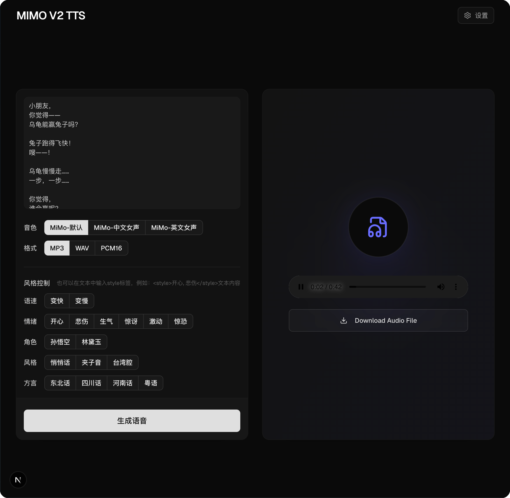

# MiMo TTS UI

使用小米 [mimo-v2-tts](https://mimo.xiaomi.com/mimo-v2-tts) API 生成语音，支持音色、风格控制。

## 快速开始

1. 前往 [Xiaomi MiMo 开放平台](https://platform.xiaomimimo.com/#/console/api-keys) 创建/获取 API Key

2. 访问ui界面，在弹窗中填入 API Key

## 部分截图

## 部署

纯前端项目，可以部署到任何静态服务器上，例如 Vercel、Netlify、GitHub Pages 等。
